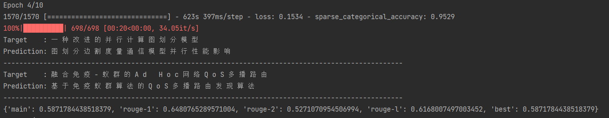

# lasertagger-chinese

使用bert4keras对lasertagger在中文任务上进行了复现

### 数据
使用中文短文本摘要CSL数据为基准数据集，下载地址为[CSL数据集](https://github.com/CLUEbenchmark/CLGE#1-csl-%E4%B8%AD%E9%95%BF%E6%96%87%E6%9C%AC%E6%91%98%E8%A6%81%E7%94%9F%E6%88%90)

### 预训练模型
预训练模型可以使用bert，roberta等等，本作采用GAU-alpha-base，下载地址为[GAU-alpha](https://github.com/ZhuiyiTechnology/GAU-alpha)

### 步骤
1. 首先更改*phrase_vocabulary_optimization.py*中flags对应的input_file和output_file，然后运行，在对应output_file目录会生成**label_map.txt和label_map.txt.log**
2. 接着运行*main.py*，需要修改*main.py*中对应的模型地址以及*data_loader.py*中对应的地址

### 更新
2022.7.15 最近将环境更换到了tf1，于是对代码进行了一点小改动并进行了重新训练，使用GAU的vocab进行tokenize并使用adamW进行训练，训练结果在v0.0.2版本中可以看到
## v0.0.1
### 环境
bert4keras==0.11.3  
tensorflow-gpu==2.1.0  
windows

### 结果
对验证集的预测的效果如下，平均1s可以预测14个样本
***
100%|██████████| 698/698 [00:47<00:00, 14.54it/s]  
{'main': 0.5333193455638408, 'rouge-1': 0.6020930159841356, 'rouge-2': 0.46388364783442765, 'rouge-l': 0.5683682080831056, 'best': 0.5333193455638408}
***

## v0.0.2
### 环境改变
tensorflow-gpu==0.15.5
### 结果
应[issue1](https://github.com/hanggun/lasertagger-chinese/issues/1) 的建议，给出了预测的一些example

### 问题
1. 文本编辑模型lasertagger虽然可以做到不错的预测效率与不错的rouge，但是缺点也很明显，由于没有像语言模型一样考虑上下文，会存在预测出的语句不通顺的情况
2. lasertagger的泛化性比较弱，因为其添加词汇来自于词汇表  
3. 文本的覆盖率只有56%，对于无法通过增删获得target的文本，简单的进行了忽略
4. lasertagger适用于摘要或者标题大部分可以在文章中找到的文本

欢迎一起探讨问题，联系方式为panshuai2019ps@163.com
